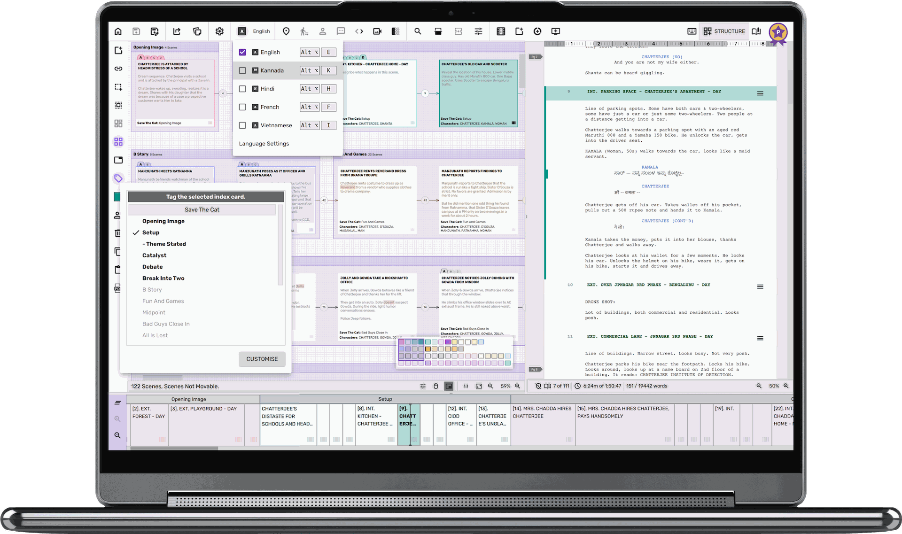

# SCRIBE

SCRIBE is an offline-first desktop screenwriting application. It is built on the
[Scrite](https://github.com/teriflix/scrite) codebase (GPLv3), integrated and tuned in this
repository so that writing, structuring and managing screenplays works fully on your local
machine — with no startup splash screen, no blocking network calls at launch, and graceful
behaviour when you are offline.



## Features

- Create screenplays and format elements appropriately.
- Type in multiple Indian and International languages.
- Import screenplays from FinalDraft and HTML formats.
- Export screenplays to PDF, FinalDraft, Text and HTML formats.
- Generate Character and Location Reports
- Capture character and scene notes.
- Structure board, timeline, notebook, snapshots/backup history and more.

A complete user guide (from the upstream project) can be found
[here](https://www.scrite.io/docs/userguide); its sources live in `docs/userguide`.

## Local-first / offline behaviour

SCRIBE starts fast and stays usable without an Internet connection:

- **No splash screen.** The startup splash/flash dialog was removed completely. The
  application window appears directly on launch. (See
  `apps/desktop/qml/init/AppInitStateMachine.qml`.)
- **No startup network calls on the critical path.** Optional background services were
  deferred or made offline-safe:
  - The *check for updates* REST call now runs 60s after launch and is skipped entirely
    while the machine is offline (`apps/desktop/src/core/autoupdate.cpp`).
  - The *user-guide search index* is loaded from the local cache immediately; the remote
    index refresh is deferred and fails silently offline
    (`apps/desktop/src/core/userguidesearchindex.cpp`).
  - The *subscription plan taxonomy* fetch backs off progressively (up to 10 minutes)
    instead of retrying every 500 ms when offline
    (`apps/desktop/qml/globals/SubscriptionPlanOperations.qml`).
- **Creating, opening, saving, editing, importing and exporting screenplays are all local
  operations** and never require a network connection. `.scrite` project files are ZIP
  archives written and read entirely on disk.
- **Crash reporting (Google Crashpad) is an opt-in build option** and is OFF by default
  (`SCRITE_WITH_CRASHPAD`). Nothing is sent anywhere by default.

### What still requires the Scrite services

Upstream Scrite pairs the desktop app with its own web services for **user accounts,
subscription entitlement and purchases**. SCRIBE deliberately does **not** bypass, fake or
circumvent that server-side authorisation:

- If you sign in, sign-in/activation/purchase flows talk to the real Scrite services and
  need connectivity.
- A signed-in session is cached locally, so a signed-in user can keep working offline.
- All other features — the entire screenwriting workflow — work without an account.

## Building from source

SCRIBE is developed using Qt 6.11. To build it, install Qt 6.11+ on your computer (Windows,
macOS, or Linux) and CMake 3.27+.

Open the project in Qt Creator (it auto-detects CMakeLists.txt) and set the build
configuration to **Release**, or build from the command line:

```bash
cmake -B build -S . -DCMAKE_BUILD_TYPE=Release
cmake --build build --config Release
```

Build artifacts are placed in the `binary/` directory.

All third-party libraries (KDE Sonnet, QuaZip, OpenXLSX, ECM, sanscript.js and others) are
vendored under `thirdparty/`, so no git submodules need to be initialised.

### Platform notes (from upstream Scrite)

#### Windows
Ensure that you have OpenSSL 3 installed. Windows 10+ is supported.

#### macOS
Any version of macOS supported by Qt 6.11 should work. Builds are universal binaries
(x86_64 + arm64).

#### Linux
- Hunspell (spellcheck): `sudo apt-get install libhunspell-dev`
- Runtime libs: `sudo apt install libxcb-cursor0 libxcb-xinerama0`
- OpenSSL 3: `sudo apt install libssl-dev`
- Language support (transliteration) requires IBUS:
  `sudo apt install ibus ibus-m17n libibus-1.0-dev`, then set up languages with
  `ibus-setup`.

## Documentation site (mkdocs)

To build/serve the bundled user guide:

```bash
cd docs/userguide
pip install mkdocs mkdocs-material mkdocs-video
python -m mkdocs serve   # then open http://127.0.0.1:8000
```

## Reporting issues

Please report SCRIBE integration issues in this repository's issue tracker. Upstream Scrite
development happens at https://github.com/teriflix/scrite (community discussions on their
Discord server: https://discord.gg/bGHquFX5jK).

## License and attribution

SCRIBE is based on [Scrite](https://github.com/teriflix/scrite) by Teriflix / IEDN
Technologies Pvt. Ltd. and contributors. The Scrite source code is licensed under the
**GNU General Public License v3**; the full license text, copyright notices, the commercial
binary-license notice for official Scrite releases, and third-party license information are
preserved verbatim in [LICENSE.txt](./LICENSE.txt). The vendored third-party libraries under
`thirdparty/` retain their own license files.

If you redistribute SCRIBE in source or binary form, the GPLv3 obligations described in
LICENSE.txt apply.

## Conference Talks based on the Scrite codebase

These talks may help you find your way around the code.

- Solving Problems for Yourself, and Accidentally Thousands More - [IndiaFOSS
  2025](https://www.youtube.com/watch?v=2O9A4HRlJAY)
- Closing The Gaps - QML on the Desktop - [Qt DevCon 2022](https://youtu.be/tyn90zQZTEg)
- Building Beautiful Desktop Apps Using QML - [Qt DevDes Days 2021](https://youtu.be/zQAGs8cuGv8)
- Insights from Building Scrite Using QML - [Qt Desktop Days 2020](https://youtu.be/z7GEUrRyh0U)
